# Production-Grade CI/CD Pipeline with Kubernetes, Monitoring & Zero-Downtime Deployment

## Project Goal

This project demonstrates an industry-style software delivery system where a code push triggers automated build, test, containerization, deployment, observability, and scaling. The main purpose is to show how a Java application can move from source code to a running Kubernetes workload with minimal manual intervention and no service interruption during updates.

## What This Project Is

This repository contains a small Spring Boot web application packaged with Docker, deployed to Kubernetes, and coordinated through Jenkins. Around that application is a complete delivery stack for blue/green rollout, autoscaling, monitoring, and centralized logging.

## Architecture

The system is organized as a simple delivery chain:

1. Source code lives in `app/` as a Spring Boot web service.
2. Maven builds the application into a runnable jar.
3. Docker packages the jar into a container image.
4. Kubernetes runs the image using blue and green deployments behind a service.
5. Jenkins automates the build, image publish, and deployment promotion steps.
6. Prometheus and Grafana monitor health and performance.
7. Elasticsearch, Logstash, and Kibana collect and visualize logs.
8. Horizontal Pod Autoscaler scales the workload when load increases.

### System Diagram

```mermaid
graph LR
    A["👨‍💻 Developer"] -->|git push| B["GitHub Repo"]
    B -->|webhook trigger| C["Jenkins"]
    
    C -->|Checkout| D["Build & Test"]
    D -->|mvn clean package| E["Docker Build"]
    E -->|docker build| F["Docker Image"]
    F -->|docker push| G["Container Registry"]
    
    G -->|pull image| H["Kubernetes Cluster"]
    
    H -->|Deploy Inactive| I["Blue Deployment<br/>v1.0"]
    H -->|Health Checks| J["Service Selector<br/>Routes Traffic"]
    H -->|Deploy Active| K["Green Deployment<br/>v2.0"]
    
    I -->|readiness/<br/>liveness probes| J
    K -->|readiness/<br/>liveness probes| J
    
    J -->|scales based<br/>on CPU| L["HPA<br/>2-5 replicas"]
    
    I -->|logs TCP:5000| M["Logstash"]
    K -->|logs TCP:5000| M
    M -->|parse & forward| N["Elasticsearch<br/>:9200"]
    N -->|query| O["Kibana<br/>:5601"]
    
    I -->|metrics| P["Prometheus"]
    K -->|metrics| P
    P -->|visualize| Q["Grafana<br/>:3000"]
    
    R["Users"] -->|HTTP| J
    
    style C fill:#1e3a5f
    style H fill:#1e3a5f
    style M fill:#663399
    style N fill:#663399
    style O fill:#663399
    style P fill:#9d4edd
    style Q fill:#9d4edd
```



**Data Flow:**
- **CI/CD Pipeline (Jenkins → Container Registry):** Code changes trigger automated build, test, and containerization
- **Deployment (Registry → Kubernetes):** Images deployed to blue/green deployments with health checks and automatic scaling
- **Logging (App → ELK Stack):** Application logs ship to Logstash via TCP, aggregated in Elasticsearch, visualized in Kibana
- **Monitoring (App → Prometheus → Grafana):** Application metrics collected by Prometheus and displayed in Grafana dashboards

## Pipeline Purpose

The pipeline exists to automate the path from code change to production-ready release. Its job is to:

- build the application
- run the test suite
- create a Docker container image
- push the image to a registry
- deploy the new version to Kubernetes
- switch traffic with zero-downtime blue/green promotion
- keep the inactive color available for rollback

## Deployment Wiring

The Jenkins pipeline is parameterized so you can point it at a real registry and cluster without editing the pipeline again:

- `IMAGE_REPOSITORY`: full image path, such as `ghcr.io/your-org/cicd-app`
- `REGISTRY_URL`: registry host used for login, such as `ghcr.io`
- `REGISTRY_CREDENTIALS_ID`: Jenkins credentials ID for registry auth
- `KUBE_NAMESPACE`: Kubernetes namespace to deploy into
- `KUBE_CONTEXT`: optional kubectl context name if Jenkins has access to multiple clusters

The Kubernetes manifests are rendered from tokens at build time, so the same files can be reused across environments.

## Deployment Strategy

The project uses blue/green deployment to reduce release risk. The active version serves traffic while the next version is deployed separately. After validation, the service selector is switched to the new version. If the new release fails, traffic can be redirected back to the previous deployment quickly.

The Jenkins pipeline and the PowerShell deploy helper now detect the currently active color and promote the opposite deployment automatically.

## Main Components

- `app/`: Spring Boot service with HTTP endpoints.
- `app/Dockerfile`: Container image build definition.
- `jenkins/Jenkinsfile`: CI/CD pipeline definition.
- `k8s/`: Namespace, service, blue/green deployments, and HPA manifests.
- `logging/`: Elasticsearch, Logstash, and Kibana manifests and configuration.
- `monitoring/`: Prometheus and Grafana configuration.
- `scripts/`: Local build, prerequisite, and Kubernetes deployment helpers.

## Functionalities

- `GET /`: Returns a simple application status message.
- `GET /health`: Returns `OK` for health checks.
- Docker image build from the packaged jar.
- Kubernetes deployment with blue/green rollout support.
- Horizontal Pod Autoscaler for automatic scaling.
- Jenkins-driven delivery flow.
- Centralized logging and metrics for observability.
- Application logs forwarded to Logstash when the `kubernetes` Spring profile is active.
- Rollback-ready release strategy through blue/green switching.

## Prerequisites

Install the following tools before running the project locally:

- Java 17 or newer
- Maven
- Docker
- kubectl
- Helm
- Minikube or another Kubernetes cluster

On Windows, Docker Desktop and some Minikube drivers require an Administrator shell during installation/startup.

## Quick Start

```powershell
./scripts/check-prereqs.ps1
./scripts/run-local.ps1
```

The app should respond at:

```text
http://localhost:8080/health
```

## Build

The Maven project lives in `app/`, so run build commands from that folder or point Maven at `app/pom.xml`.

```powershell
cd app
mvn clean package
```

## Docker Image

Build the container image from the `app/` directory so the Dockerfile can copy the packaged jar from `target/`. Replace the image path with the registry you configure in Jenkins or in the PowerShell deploy script.

```powershell
docker build -f app/Dockerfile -t ghcr.io/your-org/cicd-app:1 app
```

## Kubernetes Deploy

Create the namespace first, then apply the workloads and service. The deploy helper now renders the namespace and image placeholders before applying the manifests.

```powershell
./scripts/deploy-k8s.ps1 -ImageRepository ghcr.io/your-org/cicd-app -ImageTag 1 -KubeNamespace devops
```

If Minikube is not running yet, start it first:

```powershell
minikube start
```

## Monitoring

Install Prometheus and Grafana using the provided values file, then apply the app PodMonitor.

```powershell
helm repo add prometheus-community https://prometheus-community.github.io/helm-charts
helm repo update
helm upgrade --install monitoring prometheus-community/kube-prometheus-stack -n monitoring --create-namespace -f monitoring/prometheus-values.yaml
kubectl --context minikube apply -f monitoring/podmonitor-cicd-app.yaml
```

Detailed steps are documented in `monitoring/grafana-notes.md`.

## Run Order

1. Start Minikube or connect `kubectl` to your cluster.
2. Build and test the app with `mvn test` from `app/`.
3. Build the Docker image from `app/`.
4. Apply the Kubernetes manifests from `k8s/` and `logging/`.
5. Run the Jenkins pipeline for automated delivery.
